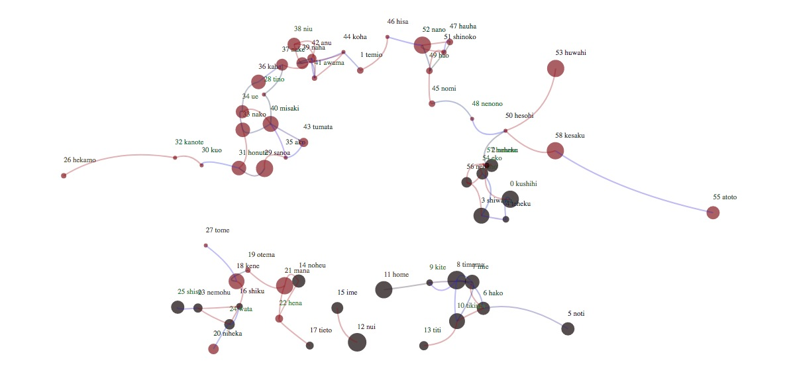

para actualizar el sitio

se pueden agregar textos

en index.html cada texto se ve como:

        <li> 
          
          <a texto='agamben.txt'>Gusto de Agamben</a>
        </li>

Ahi se ve como es la sintaxis para incorporar

imagen
título
texto. ( archivo txt )

        <li> 
          
          <a texto='ARCHIVO_DE_TEXTO.txt'>TITULO DEL TEXTO</a>
        </li>
        
        
        
        
    Pasos para agregar un texto:
    
    1 ir a https://github.com/ivdetanti/textos
    
    2 ir a "new file"
    
    3 poner nombre al nuevo archivo por ejemplo "mitexto.txt".  (usar .txt)
    
    4 allí se puede escribir el texto, o pegarlo
    
    5 apretar "commit changes"  ( guardar )
    
    
    6  ir a https://github.com/ivdetanti/textos
    
    7 abrir index.html
    
    8 apretar "edit file" ( el ícono de lapiz )
    
    9 agregar a la lista: 
    
         <li> 
          
          <a texto='nombre.txt'>título</a>
        </li>
      
      usando el título del texto y el archivo txt creado
      
    10 apretar "commit changes"  
      
        
        11 subir la imagen a la carpeta img
           ir a 
           
        
        
        
    
        
